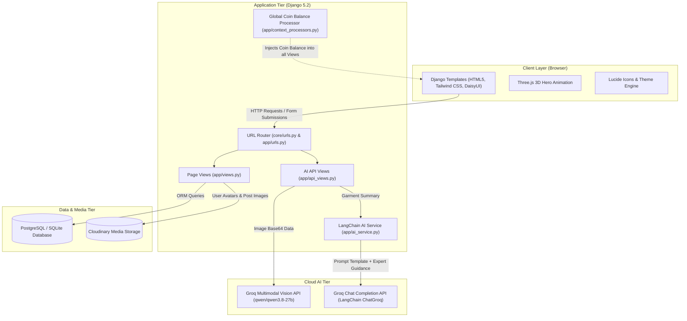
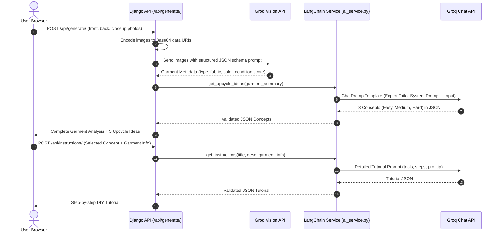
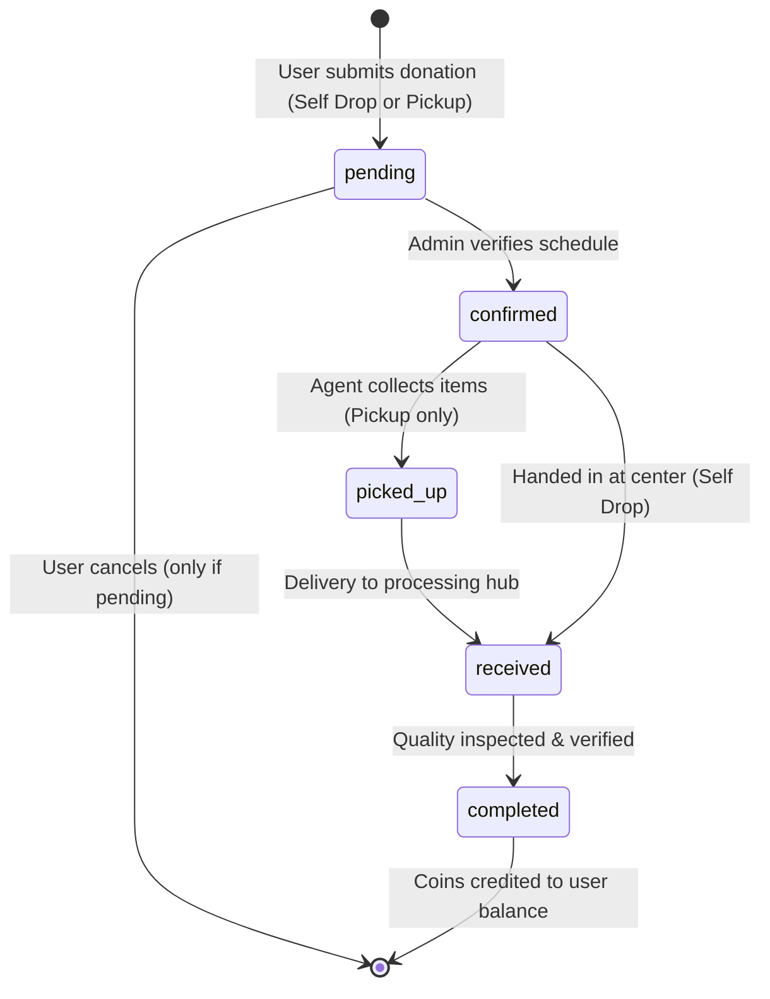
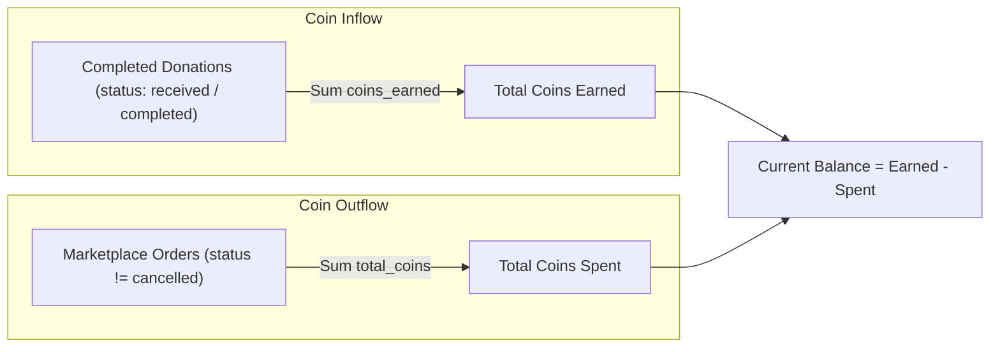
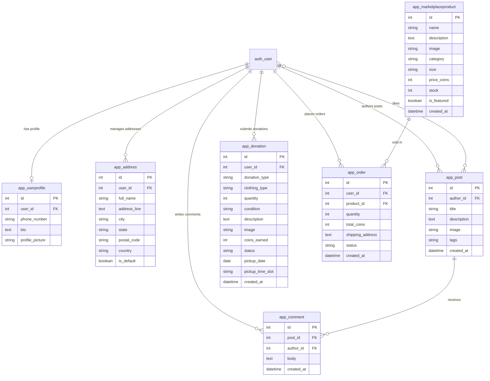

# fAIshon — Project Architecture & Working Specification

> **AI-Powered Sustainable Fashion & Circular Economy Platform**  
> *BCA Final Year Project*

---

## 1. Executive Summary

**fAIshon** is a full-stack sustainable fashion platform built with **Django 5.2**, **LangChain**, the **Groq API**, and **Cloudinary**. The platform tackles the global textile waste crisis by establishing an incentivized circular fashion ecosystem:

1. **AI Upcycle Studio**: Analyzes uploaded garment photos and generates creative, tailored upcycling concepts with step-by-step tailoring tutorials.
2. **Clothes Donation System**: Users donate unused clothes (via drop-off or pickup) and earn **fAishon Coins** based on garment condition.
3. **Circular Marketplace**: Upcycled apparel and accessories can be purchased exclusively using earned coins.
4. **Community Feed**: A dedicated social space where creators showcase upcycling projects, comment, and exchange ideas.

---

## 2. System Architecture

The following diagram illustrates the high-level architecture and communication between the frontend, Django application tier, database, Cloudinary media storage, and the Groq AI service:



---

## 3. Technology Stack

| Layer | Technology | Purpose |
|---|---|---|
| **Backend Framework** | Django 5.2.11 (Python 3.11) | Web framework, ORM, authentication, and session handling |
| **AI & Orchestration** | LangChain Core 1.3, LangChain-Groq 1.1 | LCEL prompt chaining and integration with Groq models |
| **Vision & LLM** | Groq API (`qwen/qwen3.8-27b`) | Multi-image garment visual analysis and DIY guide generation |
| **Database** | PostgreSQL (`psycopg3`) or SQLite | Relational database (supports `USE_SQLITE=True` for free tier) |
| **Media Storage** | Cloudinary & `django-cloudinary-storage` | Secure cloud storage for user avatars, posts, and products |
| **Production Server** | Gunicorn 25.1 | WSGI HTTP production server |
| **Frontend Styling** | Tailwind CSS & DaisyUI 4.10 | Utility-first styling with 10+ dynamic themes and OKLCH accent picker |
| **Interactive Visuals** | Three.js (v0.160.0) | Interactive 3D garment visual on landing page |
| **Icons** | Lucide Icons | Unified icon set across dashboard and community |

---

## 4. Detailed Working of Core Modules

### 4.1. AI Upcycle Studio ([`app/api_views.py`](file:///home/mizu/Downloads/Telegram%20Desktop/faishon-project/app/api_views.py) & [`app/ai_service.py`](file:///home/mizu/Downloads/Telegram%20Desktop/faishon-project/app/ai_service.py))

The AI Upcycling Studio operates in two sequential phases:



#### Phase 1: Garment Analysis & Concept Generation (`/api/generate/`)
1. The user uploads 3 photos: **Front View**, **Back View**, and **Texture / Damage Closeup**.
2. Django encodes the uploaded images into Base64 format and submits them to Groq's multimodal vision model.
3. The vision model extracts technical garment attributes:
   - `garment_type` (e.g., T-Shirt, Jeans, Flannel Shirt)
   - `fabric_type` (e.g., 100% Cotton, Denim Twill, Wool Knit)
   - `primary_color` & `secondary_colors`
   - `pattern` (e.g., Solid, Plaid, Striped)
   - `estimated_reusability_score` (0–100%)
4. The garment description is forwarded to [`get_upcycle_ideas()`](file:///home/mizu/Downloads/Telegram%20Desktop/faishon-project/app/ai_service.py#L48-L103), which invokes a LangChain prompt chain embedded with sustainable tailoring rules.
5. The model returns 3 actionable concepts graded by difficulty (`Easy`, `Medium`, `Hard`).

#### Phase 2: Tutorial Generation (`/api/instructions/`)
1. When the user selects a concept, the client requests [`POST /api/instructions/`](file:///home/mizu/Downloads/Telegram%20Desktop/faishon-project/app/api_views.py#L133-L172).
2. [`get_instructions()`](file:///home/mizu/Downloads/Telegram%20Desktop/faishon-project/app/ai_service.py#L106-L162) constructs a master tailor prompt tailored to the fabric:
   - Specific needles, threads, and tools (e.g., denim needle size 16, ballpoint for knits).
   - Ordered instructions (measuring -> cutting -> pinning -> sewing -> finishing).
   - Estimated time in minutes and a professional tailor's `pro_tip`.

---

### 4.2. Clothes Donation & Reward System ([`app/models.py:Donation`](file:///home/mizu/Downloads/Telegram%20Desktop/faishon-project/app/models.py#L63-L111))



#### Coin Calculation Rules
Coins are calculated using [`calculate_coins()`](file:///home/mizu/Downloads/Telegram%20Desktop/faishon-project/app/models.py#L107-L110):
$$\text{Coins Earned} = \text{Condition Rate} \times \text{Quantity}$$

| Condition | Coins per Garment | Criteria |
|---|---|---|
| **Like New** | 20 coins | No visible wear, original shape and color intact |
| **Good** | 15 coins | Minor wear, clean, structurally sound |
| **Fair** | 10 coins | Visible fading or minor fabric wear, fully reusable |
| **Needs Repair** | 5 coins | Minor tears, missing buttons, or seams to repair |

---

### 4.3. Coin Economy & Ledger Architecture ([`app/context_processors.py`](file:///home/mizu/Downloads/Telegram%20Desktop/faishon-project/app/context_processors.py))

Instead of maintaining a static integer that can drift out of sync, fAIshon uses a **computed dynamic ledger**:



- **Injected Globally**: Available across all templates via `{{ coin_balance }}` without redundant database queries.
- **Atomic Order Deduction**: When placing an order, Django checks `balance >= total_cost` and decrements product inventory before creating the order record.

---

### 4.4. Circular Marketplace & Order Tracking ([`app/models.py:MarketplaceProduct`](file:///home/mizu/Downloads/Telegram%20Desktop/faishon-project/app/models.py#L115-L181))

1. **Catalog & Filtering**: Products can be filtered by categories (`Tops`, `Bottoms`, `Dresses`, `Outerwear`, `Accessories`, `Footwear`, `Kids`, `Other`) and text search.
2. **Featured Showcase**: Curated high-demand items highlighted in the top carousel.
3. **Purchase Flow**:
   - The user selects a product and specifies quantity and delivery address.
   - The view verifies:
     1. Address provided.
     2. Product `stock >= quantity`.
     3. User's available `coin_balance >= total_cost`.
   - On success, stock is decremented, the order is created with status `placed`, and coins are deducted from the user's available ledger.
4. **Order Tracking**: Order statuses progress through `placed` → `confirmed` → `shipped` → `delivered` (or `cancelled`).

---

### 4.5. Community Feed & Social Collaboration ([`templates/community.html`](file:///home/mizu/Downloads/Telegram%20Desktop/faishon-project/templates/community.html))

- **Post Publishing**: Users publish upcycled projects with title, description, tags, and photos.
- **AJAX Interactions**:
  - **Like Toggle**: Instant heart counter toggle with zero page reload.
  - **Inline Comments**: Real-time comment submission and deletion.
  - **Edit Post**: Fetch-driven modal populated via JSON endpoint `/community/post/<id>/edit/`.
  - **Delete Post & Comments**: Soft confirmation modal and instant removal.

---

## 5. Database Entity Relationship Diagram



---

## 6. API Specifications

### 6.1. Generate Upcycle Ideas
- **URL**: `POST /api/generate/`
- **Auth**: Required (`@login_required`)
- **Headers**: `X-CSRFToken: <token>`
- **Body**: `multipart/form-data` containing:
  - `front`: Image File
  - `back`: Image File
  - `closeup`: Image File
- **Response**:
```json
{
  "garment_type": "Denim Jacket",
  "subcategory": "Vintage Trucker",
  "primary_color": "Faded Indigo",
  "secondary_colors": ["Copper"],
  "fabric_type": "100% Heavy Cotton Denim",
  "pattern": "Solid",
  "fit": "Regular",
  "sleeve_length": "Long",
  "estimated_reusability_score": 92,
  "confidence": 0.96,
  "concepts": [
    {
      "title": "Utility Crossbody Tote",
      "difficulty": "Easy",
      "description": "Utilize body panels and chest pockets to create a multi-pocket everyday tote."
    },
    {
      "title": "Distressed Crop Vest",
      "difficulty": "Medium",
      "description": "Remove sleeves, crop lower hem, and fray edges for a modern streetwear silhouette."
    },
    {
      "title": "Structured Bucket Hat",
      "difficulty": "Hard",
      "description": "Deconstruct sleeve panels into crown and brim pieces for an all-weather hat."
    }
  ]
}
```

### 6.2. Generate DIY Instructions
- **URL**: `POST /api/instructions/`
- **Auth**: Required (`@login_required`)
- **Headers**: `Content-Type: application/json`, `X-CSRFToken: <token>`
- **Body**:
```json
{
  "title": "Utility Crossbody Tote",
  "description": "Utilize body panels and chest pockets to create a multi-pocket everyday tote.",
  "garment_info": {
    "garment_type": "Denim Jacket",
    "fabric_type": "100% Heavy Cotton Denim",
    "primary_color": "Faded Indigo"
  }
}
```
- **Response**:
```json
{
  "tools_needed": [
    "Heavy-duty fabric shears",
    "Denim sewing needle (Size 16/100)",
    "Heavy polyester thread",
    "Measuring tape and tailor's chalk"
  ],
  "estimated_time_minutes": 75,
  "instructions": [
    "Step 1: Lay the jacket flat and measure a line 2 inches below the chest pockets.",
    "Step 2: Carefully cut across both layers with sharp fabric shears.",
    "Step 3: Remove the sleeves and slice them open along the seam to create strap strips.",
    "Step 4: Fold and stitch the strap strips into 1.5-inch durable handles.",
    "Step 5: Turn the jacket body inside-out and sew the bottom hem closed with a double straight stitch.",
    "Step 6: Securely box-stitch the handles to the interior top rim and press flat."
  ],
  "pro_tip": "When sewing heavy denim seams, hammer the folded layers lightly before stitching to compress bulk and avoid needle breakage."
}
```

---

## 7. Free-Tier Server Optimization

To ensure stable operation on budget or free hosting platforms (such as Render Free Tier, Railway, or Fly.io with **512MB RAM limits**), the architecture incorporates several performance strategies:

1. **Zero Local Machine Learning Models**:
   - Transitioned from local PyTorch embeddings (`all-MiniLM-L6-v2`) to cloud-executed Groq API calls.
   - RAM footprint is reduced from **~800MB–1.2GB down to ~60MB**, completely eliminating Out-Of-Memory (OOM) crashes.
2. **Database Flexibility**:
   - Set `USE_SQLITE=True` in `.env` to run with local SQLite, removing the need for a dedicated PostgreSQL database container on free hosts.
3. **Optimized Token Budgets**:
   - `max_tokens` is bounded to `800` to comply with Groq free-tier rate limits (1,000 Output Tokens Per Minute).
4. **Cloudinary Asset Offloading**:
   - All static media and uploads bypass application server disk storage, minimizing ephemeral disk usage and bandwidth consumption.
